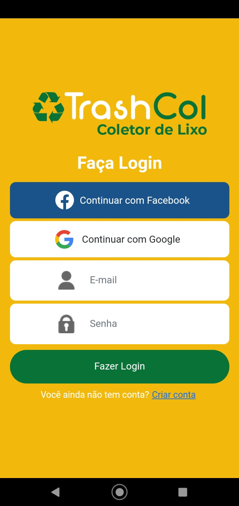
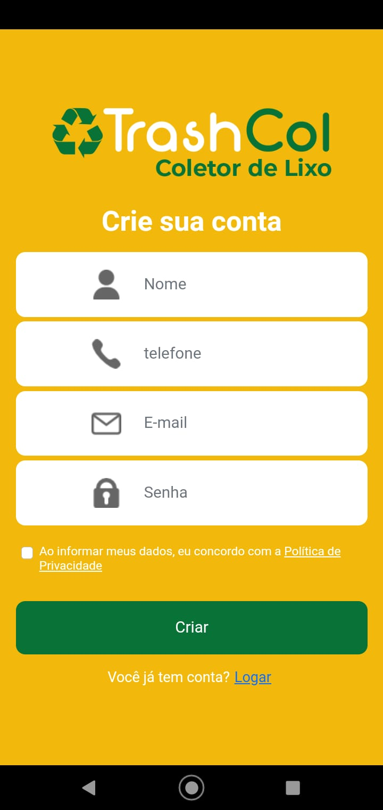
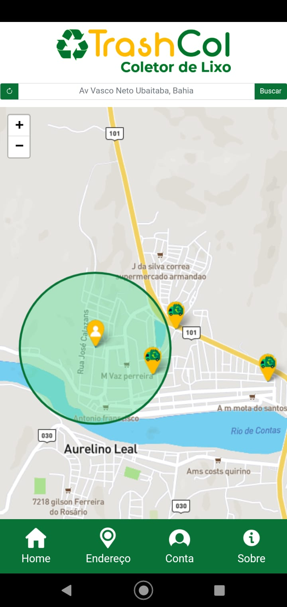
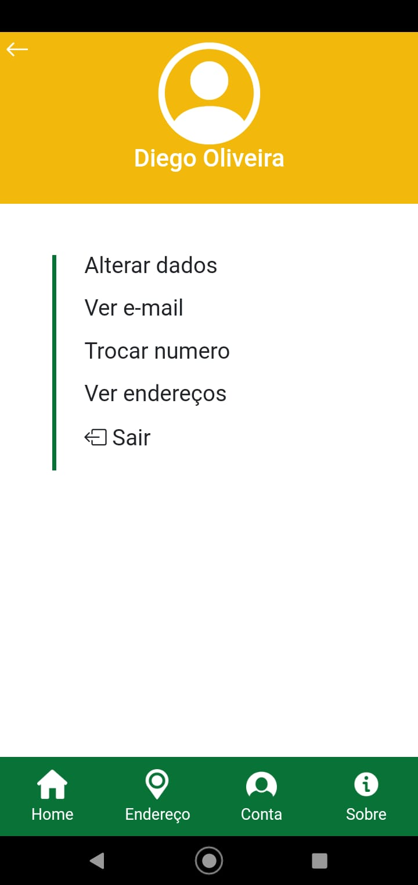

# Trashcol

## O Trash Col (Coletor de Lixo) é um aplicativo que foi criado com a finalidade de evitar o acúmulo desnecessário de lixo em locais públicos. Ele também serve para avisar a população sobre os horários em que os coletores irão chegar nas ruas.
## A utilização do sensor de GPS (geolo calização) é necessário para que o acesso às informações dos coletores seja realizada.

## Capturas de Tela

